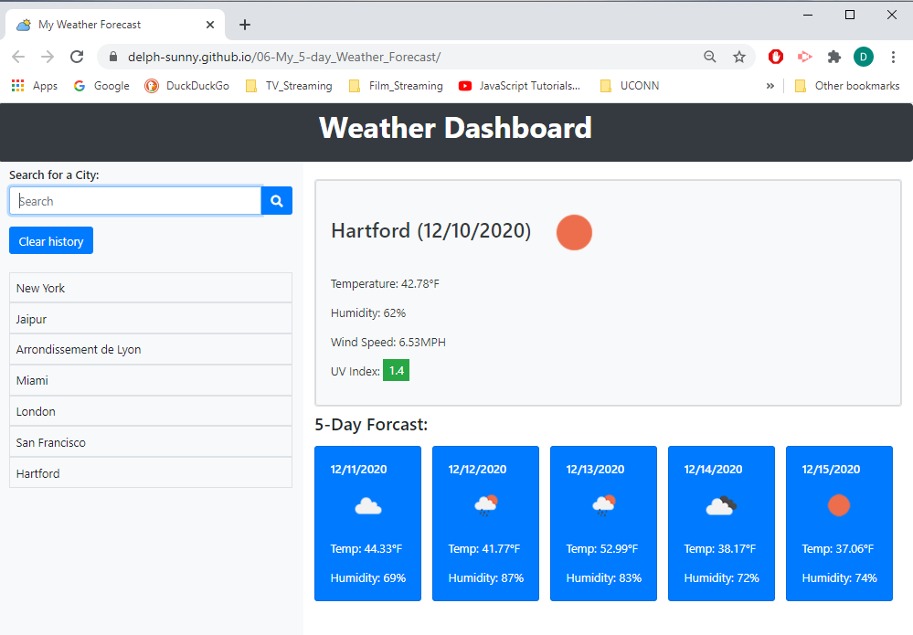

# 06-My_Five-day_Weather_Forecast
:partly_sunny:
---

## Description 
The webpage is a __weather forecast__ created using Bootstrap, JQuery and an [API]. This app will allow a user to get the current weather and a 5-day forecast for multiple specific cities.  
The following criteria are required for this app:  
- [X] A search for a city, will display the current and future conditions for that city and store the city to the search history.  
- [X] The view of the current weather conditions for that city displays the city name, the date, an icon representation of weather conditions, the temperature, the humidity, the wind speed, and the UV index.    
- [X] The UV index view will have a color that indicates whether the conditions are favorable, moderate, or severe.  
- [X] The future weather conditions for that city will display a 5-day forecast that with the date, an icon representation of weather conditions, the temperature, and the humidity.  
- [X] Clicking on a city in the search history will display current and future conditions for that city again.  
- [X] The weather dashboard shows the last searched city forecast.  
  
A button to clear the search history was added. The user input is also check for valid entry. Unvalid searches will not be kept. Moreover only the weather of valid cities will be displayed.  
Finally a loader was added when the page is loaded in case of a slow answer from the API.  

## Installation

Click on this [link] or download the entire repository, unzip the files and double-click on `index.html` to see the page in an internet browser.  
Enter a new city name in the search field or click on a city name in the search history to display the current weather and its forecast for the next 5 days. 

## Image of the app :mag:

## Credits
 
Icons made by Freepik from [www.flaticon.com](https://www.flaticon.com/)

## License

Copyright (c) 2020 DT. Everyone is permitted to use, copy, and modify verbatim copies of this document.

---
[link]: https://delph-sunny.github.io/06-My_5-day_Weather_Forecast/
[API]: https://openweathermap.org/api
